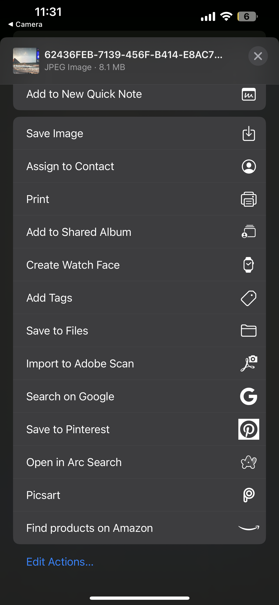

# React Native Camera App 📸

A simple and modern camera app built with React Native and Expo.

## 📱 Features

- Camera with front
- Photo capture preview
- Photo sharing

## 📸 Preview
<div align="center">
   
   
   
</div>

## 🚀 Quick Start

```bash
# Install dependencies
npm install

# Start the app
npm start
```
